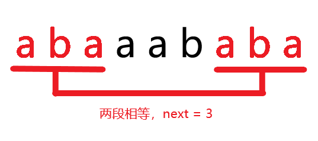
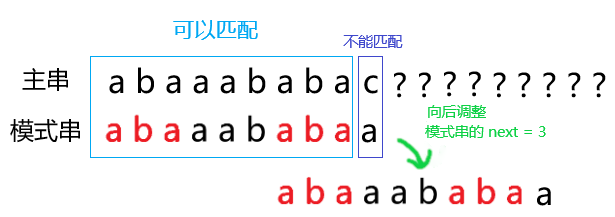
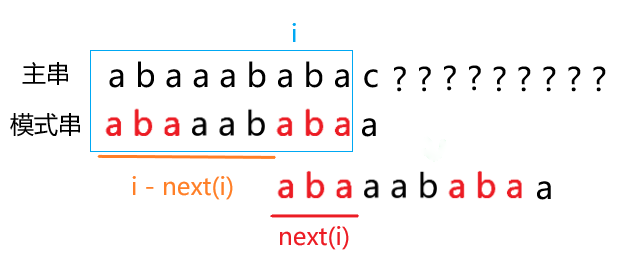
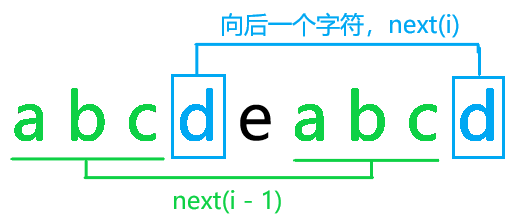
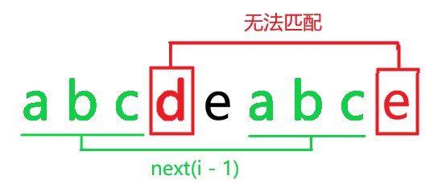

## 引入

> 什么是 KMP？

KMP 是一种 $O(n)$ 求解一个字符串 $t$ （模式串）在另一个字符串 $s$ （主串）中 **所有** 出现的地方和总次数。

> KMP 有什么用？

可以解决很多关于子串的问题。


以下使用 $s[l .. r]$ 表示 $s_ls_{l + 1}\cdots s_r$。


## 思路

### 暴力算法

首先考虑暴力算法：

> 枚举 $i \in [1, n]$，比较 $t[i .. i + len(m) - 1]$ 和 $s$。  
> 时间复杂度 $O(n^2)$。

过程：


那么为什么暴力这么慢呢？  
问题出在两个地方：

1. 每一个位置都要比较
2. 字符串需要 $O(n)$ 比较

第二个基本上没法优化了（因为字符串比较真的需要 $O(n)$），但第一个可以优化。  
我们只需要不让每一个位置都需要比较就好了。

于是我们就得到 KMP 的核心思想。

### KMP 思想

我们在暴力匹配时除了匹配成功与失败，还有 **别的有用信息** 吗？  
答案是有的。

除了没有匹配成功以外，我们还可以得到 **有多少个字符的前缀是可以匹配的**。

例如：


那么知道了这些信息有什么用呢？  
我们可以 **将一些情况排除**，也就是跳过从某些位置开始匹配的步骤！

具体的：


再看一个例子：


当我们发现已知的字符串可以匹配主串前几位时，就可以计算出下一步直接移动到哪里，跳过一些情况。  
这就是 $next$ 数组！

### next 数组

#### next 定义

$next(i)$ 表示在 $t[1 .. i]$ 中，满足 $t[1 .. x] = t[i - x + 1 .. i]$ 且 $x < i$ 的最大的 $x$。（这里是对模式串做匹配哦）


$s$ 是主串，$t$ 是模式串。


#### next 用法

求出了 next 数组如何求出答案呢？

考虑一个字符串：


那么它的 next 如下：



这个 next 有什么用呢？看下图：



我们发现，每次向后移动是将 **能匹配上的字符串** 的 **长度为 $next(i)$ 的前缀后缀** 对齐。  
也即：如果模式串 $t$ 的前 $i$ 个字符能匹配上，那么将模式串向后移动 $i - next(i)$ 个字符，匹配下标从 $i - next(i)$ 移动到 $next(i)$。（见下图）



#### next 求法

采用 DP 思想：现在已经求出了 $next(1 .. i - 1)$，如何求 $next(i)$？

对于下面字符串：


第一种情况，向后一个字符（图中蓝色）也相同，直接转移即可。



第二种情况，向后一个字符（图中红色）不同。



怎么办呢？  
这时就要退而求其次，也就是说我们要取一个比 $next(i - 1)$ 更小一点的 $x$ 使得 $t[1 .. x] = t[i - x + 1 .. i]$。  
直接上结论：取 $x = next(next(i - 1))$


原因：  
由 $next(i - 1)$ （红色）得③处相等，而由 $next(next(i - 1))$ （绿色）得①处相等。  
①和③放在一起推得①②的四个字符串都相等，所以得到 $t[1 .. x] = t[i - x + 1 .. i]$。

### 复杂度

容易发现 $j$ 的增量不超过 $n$ （见代码），所以它的减少量也不超过 $n$，所以总复杂度 $O(n)$。

## 代码实现

``` cpp
void kmp(const char *s, const char *t, vector<int> &ans) { // s, t 下标从 1 开始
    n = strlen(s + 1), m = strlen(t + 1);
    next[1] = 0; // 如果下标从 0 开始，那么这里应该是 next[0] = -1
    for(int i = 2, j = 0; i <= m; i++) {
        while(j && t[j + 1] != t[i]) j = next[j];
        if(t[j + 1] == t[i]) j++;
        next[i] = j;
    }
    for(int i = 1, j = 0; i <= n; i++) {
        while(j && t[j + 1] != s[i]) j = next[j];
        if(t[j + 1] == s[i]) j++;
        if(j == m) {
            ans.push_back(i - m + 1);
            j = next[j]; // 匹配结束之后也要继续匹配
        }
    }
}
```

## 例题


```cpp
#include <cstdio>
#include <cstring>

const int N = 1e6 + 5;

char s[N], t[N];
int nxt[N];

int n, m;

int main() {
	std::scanf("%s%s", s + 1, t + 1);
	n = std::strlen(s + 1), m = std::strlen(t + 1);
	nxt[0] = -1;
	for(int i = 1; i <= m; i++) {
		int j = nxt[i - 1];
		while(t[j + 1] != t[i] && j != -1) j = nxt[j];
		nxt[i] = j + 1;
	}
	int j = 0;
	for(int i = 1; i <= n; i++) {
		while(j && t[j + 1] != s[i]) j = nxt[j];
		if(t[j + 1] == s[i]) j++;
		if(j == m) {
			std::printf("%d\n", i - m + 1);
			j = nxt[j];
		}
	}
	for(int i = 1; i <= m; i++) std::printf("%d ", nxt[i]);
	return 0;
}
```


