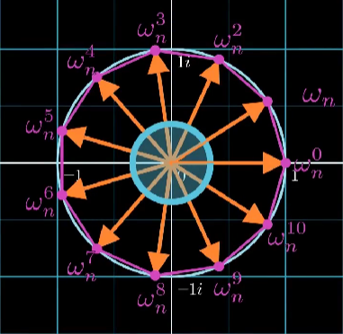

## 前置知识

[复数](https://oi-wiki.org/math/complex/)  
单位根（下面讲）  
多项式（下面讲）

### 单位根

前置知识：[复数](https://oi-wiki.org/math/complex/)

在复平面上，所有与原点距离为 $1$ 是点组成单位圆。  
由于两个复数相乘的法则（辐角相加，模长相乘），在单位圆上的两个复数相乘还是在单位圆上（模长都是 $1$），且辐角为这两个复数相加。  
所以对于 $x^n=1$ 这个方程来说，它的解在单位圆上，且辐角为 $\frac{360}{n}$ 的倍数，显然这样的复数有 $n$ 个，我们把这样的 $n$ 个复数叫做 **$n$ 次单位根**，并将其中辐角最小的（$1$ 除外）记作 $\omega_n$。  
所有 $\omega_n^i$ 都是 $n$ 次单位根。



上图就是 **$10$ 次单位根** 在复平面上的表示。

单位根有三个引理：（~~证明显然~~）

1. 消去引理：$\omega_{kn}^{km} = \omega_n^m$
2. 折半引理：$\left(\omega_{n}^{k+\frac{n}{2}}\right)^2=\omega_{n}^{2k}=\omega_{\frac{n}{2}}^k$
3. 求和引理：$\sum_{i=0}^{n-1} \left(\omega_n^k\right)^i = 0$

在 FFT 中，我们只需要用前两个。

### 多项式

这里我们讨论的多项式是只有一个变量 $x$ 的多项式，即 $F(x) = \sum_{i=0}^n a_i x^i$。

多项式有两种表示方法：（设多项式有 $n + 1$ 项）

1. 系数表示，即将多项式表示成：$[a_0, a_2, \cdots, a_n]$，其中 $a_i$ 为 $x^i$ 项的系数
2. 点值表示，即将多项式表示成：$[(v_0, F(v_0)), (v_1, F(v_1)), \cdots, (v_n, F(v_n))]$，即将 $n + 1$ 个不同的值 $v_i$ 带入多项式得到 $F(v_i)$，然后用这 $n + 1$ 个二元组唯一确定一个多项式。

容易发现，对于两个多项式 $F(x)$ 个 G(x)，设 $H(x) = F(x) \times G(x)$，如果有 $F$ 和 $G$ 的点值表示，那么 $H$ 的点值表示也可以很快算出来：$H(v_i) = F(v_i) \times G(v_i)$。

所以，FFT 要做的事就是将系数表示转换成点值表示（及其逆过程，这个后面再说）。

## FFT

### 几个概念

1. 离散傅里叶变换（Discrete Fourier Transform，DFT），即 **将系数表示转换成点值表示**，其中 $v_i = \omega_n^i$。
2. 快速傅里叶变换（即 **快速（离散）傅里叶变换**，Fast (Discrete) Fourier Transform，FFT），即快速做 DFT。

### 思路


从这里开始，我们将 $n$ 定为多项式的项数，而不是多项式的次数。


FFT 直接计算 $2^k$ 个点值，所有我们将 $n$ 取到比它大（或等于）它的第一个 $2$ 的幂次。（$n \leftarrow 2^k$）

设多项式为 $F(x) = \sum_{i=0}^{n - 1} a_i x^i$，其中 $F(\omega_n^i) = y_i$。  
容易发现 $y_i = \sum_{j=0}^n a_j (v_i)^j = \sum_{j=0}^n a_j \left(\omega_n^i\right)^j = \sum_{j=0}^n a_j \omega_n^{ij}$。  

我们首先将 $F(x)$ 的系数 $A = [a_0, a_1, \cdots, a_{n - 1}]$ 按奇偶分为 $A^{[0]}$ 和 $A^{[1]}$，即：  
$A^{[0]} = [a_0, a_2, \cdots, a_{n - 2}]$, $A_{[1]} = [a_1, a_3, \cdots, a_{n - 1}]$。

那么我们会发现 $F(x) = F^{[0]}(x^2) + xF^{[1]}(x^2)$，~~读者自证不难~~。  
所以我们就有了一个分治想法：用 $F^{[0]}$ 和 $F^{[1]}$ 的点值表示来算出 $F$ 的点值表示。

但是这里会有一个问题：$F^{[0]}$ 和 $F^{[1]}$ 的点值表示都只有 $\frac n2$ 个，所有合并后也只有 $\frac n2$ 个。  
所以我们还需要用 $F^{[0]}$ 和 $F^{[1]}$ 的 $\frac n2$ 个点值来求出 $F$ 的后 $\frac n2$ 个点值。

我们代两个值进去看看：
$$
\begin{aligned}
   F(\omega_n^k) &= F^{[0]}((\omega_n^k)^2) + \omega_n^k F^{[1]}((\omega_n^k)^2) &= F^{[0]}(\omega_{\frac n2}^k) + \omega_n^k F^{[1]}(\omega_{\frac n2}^k)\\
   F(\omega_n^{k + \frac n2}) &= F^{[0]}((\omega_n^{k + \frac n2})^2) + \omega_n^{k + \frac n2} F^{[1]}((\omega_n^{k + \frac n2})^2) &= F^{[0]}(\omega_{\frac n2}^k) - \omega_n^k F^{[1]}(\omega_{\frac n2}^k)
\end{aligned}
$$

至此，我们就可以用 $F^{[0]}$ 和 $F^{[1]}$ 求出 $F$ 的点值表示了。

## 逆 FFT

我们再回到之前的公式：$y_i = \sum_{j=0}^n a_j \omega_n^{ij}$。  
我们把它写成矩阵：$\textbf{y} = \textbf{V}_n \times \textbf{a}$，其中 $\left(\textbf{V}_n\right)_{i,j} = \omega_n^{ij}$。  
所以 $\textbf{a} = \textbf{V}_n^{-1} \textbf{y}$，其中 $\textbf{V}_n^{-1}$ 是 $\textbf{V}$ 的逆矩阵。  
通过某些~~我不会的~~方法算出来：$\left(\textbf{V}_n^{-1}\right)_{i,j} = \frac{\omega_n^{-ij}}{n}$。  
然后就用 FFT 的方法，改一下公式就好了。

## 代码

```cpp
#include <cmath>
#include <algorithm>
const int N = /* ... */;
const double PI = acos(-1);
struct Complex {
	double x, y;
	Complex(double x_ = 0, double y_ = 0) : x(x_), y(y_) {}
};
Complex operator+(const Complex &a, const Complex &b) { return Complex(a.x + b.x, a.y + b.y); }
Complex operator-(const Complex &a, const Complex &b) { return Complex(a.x - b.x, a.y - b.y); }
Complex operator*(const Complex &a, const Complex &b) { return Complex(a.x * b.x - a.y * b.y, a.x * b.y + a.y * b.x); }
struct FFT {
	int rev[N];
	int limit;
	int init(int mx) {
		int w = 0;
		limit = 1;
		while(limit <= mx) limit <<= 1, w++; // w = log2(limit)
		for(int i = 0; i < limit; i++) rev[i] = (rev[i >> 1] >> 1) | ((i & 1) << (w - 1));
		return limit;
	}
	void trans(Complex *a, int type) { // type = 1 / -1, 1 -> FFT, -1 -> IFFT
		for(int i = 0; i < limit; i++) if(i < rev[i]) std::swap(a[i], a[rev[i]]);
		for(int i = 1; i < limit; i <<= 1) {
			Complex wn = Complex(cos(PI / i), type * sin(PI / i));
			for(int j = 0; j < limit; j += (i << 1)) {
				Complex w(1, 0);
				for(int k = 0; k < i; k++, w = w * wn) {
					Complex x = a[j + k], y = w * a[j + i + k];
					a[j + k] = x + y;
					a[j + i + k] = x - y;
				}
			}
		}
		if(type == -1) for(int i = 0; i < limit; i++) a[i].x /= limit;
	}
	int trans(Complex *a, int n, int type) { int ret = init(n); trans(a, type); return ret; }
};
```

完结撒花\~


<https://www.cnblogs.com/zwfymqz/p/8244902.html>  
<https://www.bilibili.com/video/BV1Y7411W73U>

