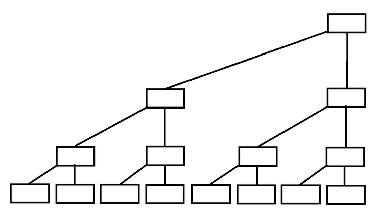

## 引入

先问几个问题。

> 什么是线段树？

线段树是一种数据结构，支持 $\log$ 级别的区间修改查询操作。

> 为什么要有线段树？

用数组实现区间查询、区间修改是 $O(n)$ 的，但用树状数组是 $O(\log n)$。

> 树状数组和线段树的对比？

1. ~~名字不一样~~
2. 两个都是 $\log$ 级数据结构
3. 树状数组支持区间查询，区间修改，但线段树支持基本上所有区间操作（$\log n$ 时间）
4. 树状数组空间复杂度 $n$，常数小；线段树空间复杂度 $4n$，常数较大。

## 树状数组原理介绍

### 前置芝士

[位运算](https://www.cnblogs.com/zengzi233/p/12117098.html)

> 大意：
> 按位与：在二进制中对每一位进行对应操作：`1&1=1`, `1&0=0`, `0&1=0`, `0&0=0`

[二叉树](http://data.biancheng.net/view/192.html)

> 大意：
> 二叉树的定义：每个节点至多有 2 个儿子的树。

### 树状数组原理

首先上一张二叉树的图：（为了方便将节点右对齐）

> 图片来源：[https://www.cnblogs.com/xenny/p/9739600.html](https://www.cnblogs.com/xenny/p/9739600.html)，已经过博主同意，下同。



是不是看着有些熟悉呢？没错，这就是[线段树](https://www.cnblogs.com/TenosDoIt/p/3453089.html)。

但是树状数组可不长这样，前面说过它的空间复杂度是 $n$。  
那树状数组是什么样呢？我们将每一列都只留最上面的节点，就变成了这样：


我们发现：（设原数组是 `a[]`，树状数组是 `c[]`）

``` plain
c[1] = a[1]
c[2] = a[1] + a[2]
c[3] = a[3]
c[4] = a[1] + a[2] + a[3] + a[4]
c[5] = a[5]
c[6] = a[5] + a[6]
c[7] = a[7]
c[8] = a[1] + a[2] + a[3] + a[4] + a[5] + a[6] + a[7] + a[8]
```

~~找规律~~发现：$c[i] = \sum_{j = i - lowbit(i) + 1}^i a_j$



$lowbit(i)$ 表示 $i$ 在二进制下最后一个 $1$。

例如：（下面的数都是二进制下的）

``` plain
lowbit(1111) = 1
lowbit(1100) = 100
lowbit(1010) = 10
lowbit(1001) = 1
lowbit(1000) = 1000
...
```

那么这个 $lowbit$ 怎么求呢？  
不难发现有很多求法，例如：

``` plain
     x = 1001010
    ~x = 0110101
~x + 1 = 0110110
```

容易发现 `x` 与 `~x + 1` 除了 $lowbit$ 位相同，其它的都不同（~~显然~~）。
所以我们得出 `lowbit(i) = x & ((~x) + 1)`，然后因为 `(~x) + 1` 就是 `-x`（参见[原码补码反码详解](https://www.cnblogs.com/zhangziqiu/archive/2011/03/30/ComputerCode.html)），所以 `lowbit(x) = x & -x`。

于是我们成功处理了 $lowbit$！



## 应用

说了这么多，树状数组到底是怎么维护区间的呢？

维护区间有四种，分别是：

- 单点修改，单点查询
- 单点修改，区间查询
- 区间修改，单点查询
- 区间修改，区间查询

下面来分别讲解。

### 单点修改，单点查询

传统数组即可。

### 单点修改，区间查询


#### 查询

从上图中我们发现
$$
\sum_{i = 1}^k a_i = c(i) + c(i - lowbit(i)) + c(i - lowbit(i) - lowbit\left(i - lowbit(i)\right) + \cdots + c(1)
$$



$$\begin{aligned}
    c(i) = &\sum_{k = i - lowbit(i) + 1}^i a_k\\
    c(i - lowbit(i)) = &\sum_{k = i - lowbit(i) - lowbit(i - lowbit(i)) + 1}^{i - lowbit(i)} a_k\\
    &\vdots\\
    a(1) = &a_1
\end{aligned}$$



上~~初步~~代码：

```cpp
int query(int r) {
    int ret = 0;
    while(r > 0) {
        ret += c[r];
        r -= lowbit(r);
    }
}
// 此时 ret 值为 a[1] + a[2] + ... + a[r]
```

还有一个问题，如果 $r = 0$ 呢？  
此时我们求的是 $a[0 .. r]$ 的和，但我们的条件是 `r > 0` 啊！  
这时我们需要特殊处理 $0$。  
为什么别的模板有些没有这么做呢？因为他们没有用到 `a[0]`。

模板：

``` cpp
int query_sum(int r) { // sum(a[1 .. r])
    if(r == 0) return c[0];
    int ret = 0;
    while(r) ret += c[r], r -= (r & -r);
    return ret + c[0];
}
int query_sum(int l, int r) { // sum(a[l .. r])
    if(l == 0) return query_sum(r);
    return query_sum(r) - query_sum(l - 1);
}
```

#### 修改

修改时我们需要将包含 $a_i$ 的 $c$ 都修改，即：  
$c(i)$, $c(i + lowbit(i))$, $c(i + lowbit(i) + lowbit(i + lowbit(i)))$, $\cdots$  

代码：

```cpp
void modify_add(int x, int y) { // a[x] += y
    if(x == 0) { t[x] += y; return; }
    while(x <= tot) c[x] += y, x += (x & -x);
}
```

其中 `tot` 为树状数组下标的最大值。

### 区间修改，单点查询

#### 前置芝士

[差分数组](https://www.cnblogs.com/young-children/p/11749156.html)

> 大意：  
> 设 $t(i) = a_i - a_{i - 1}$  
> 那么 $a_i = \sum_{j = 1}^i t(j)$

#### 原理

树状数组可以维护单点修改，区间查询，但如何实现区间修改，单点查询呢？

我们可以用维护 $a$ 的差分数组，而不是 $a$ 数组。  
此时区间修改 $[l, r]$ 可以转化成 `a[l] += add, a[r + 1] -= add`，即单点修改；  
单点查询 $a_x$ 可以转化成询问 $[1, x]$ 的和，即区间查询。

### 区间修改，区间查询

仍然利用差分：$t(i) = a_i - a_{i - 1}$

#### 查询

$$\begin{aligned}
\sum_{i = 1}^k a_i &= (t(1)) + (t(1) + t(2)) + (t(1) + t(2) + t(3)) + \cdots + \sum_{i = 1}^k t(i)\\
&= \sum_{i = 1}^k \sum_{j = 1}^i t(j)\\
&= \sum_{j = 1}^k \sum_{i = j}^k t(j)\\
&= \sum_{j = 1}^k t(j) \times (k - j + 1)\\
&= (k + 1) \sum_{j = 1}^k t(j) - \sum_{j = 1}^k t(j) \times j
\end{aligned}$$

维护两个树状数组，一个 $t(i)$，一个 $t(i) \times i$。

#### 修改

第一个 $t(i)$ 的树状数组可以像最开始一样维护，下面考虑如何维护第二个 $t(i) \times i$ 的树状数组。

在 `a[l .. r] += k` 时，$t(l + 1 .. r)$ 是不会变的，所以 $t(j) \times j (l < j \le r)$ 也都不会变。  
那么对于 $l$，$t(l)$ 增加了 $k$，则 $t(l) \times l$ 增加了 $k \times l$；$t(r + 1)$ 减少了 $k$，则 $t(r + 1) \times (r + 1)$ 减少了 $k \times (r + 1)$。

总结一下就是 `t[l] += l * k`, `t[r + 1] -= (r + 1) * k`。

代码见模板。

## 模板

``` cpp
typedef long long LL;
const int N = /* BIT::tot 的最大值 */;
const int MOD = /* 模数 */;
struct BIT { // Binary Indexed Tree
    static int tot;
    struct { // 单点修改，区间查询
        int c[N];
        int query_sum(int r) {
            if(r == 0) return c[0];
            LL ret = 0;
            while(r) ret = (ret + c[r]) % MOD, r -= (r & -r);
            return (ret + c[0]) % MOD;
        }
        void modify_add(int x, int y) {
            if(x == 0) { c[x] = (c[x] + y) % MOD; return; }
            while(x <= tot) c[x] = (c[x] + y) % MOD, x += (x & -x);
        }
    } tr1, tr2;
    int query_sum(int r) { return ((LL)(r + 1) * tr1.query_sum(r) % MOD - tr2.query_sum(r) + MOD) % MOD; }
    int query_sum(int l, int r) {
        if(l == 0) return query_sum(r);
        return (query_sum(r) - query_sum(l - 1) + MOD) % MOD;
    }
    void modify_add(int l, int r, int k) {
        tr1.modify_add(r + 1, -k + MOD), tr1.modify_add(l, k);
        tr2.modify_add(r + 1, -((LL)k * (r + 1) % MOD) + MOD), tr2.modify_add(l, (LL)k * l % MOD);
    }
};
int BIT::tot;
// 使用前记得先写：BIT::tot = n /* 树状数组下表最大值 */;
```

## 题目推荐

[洛谷 P3374](https://www.luogu.com.cn/problem/P3374) [代码](P3374.cpp)  
[洛谷 P3368](https://www.luogu.com.cn/problem/P3368) [代码](P3368.cpp)



**参考及图片来源：** <https://www.cnblogs.com/xenny/p/9739600.html>  
**关于版权：** 可以转载或以任何形式借用，但均需注明本文链接。（图片请注明上面的链接，不要注明这篇的）


